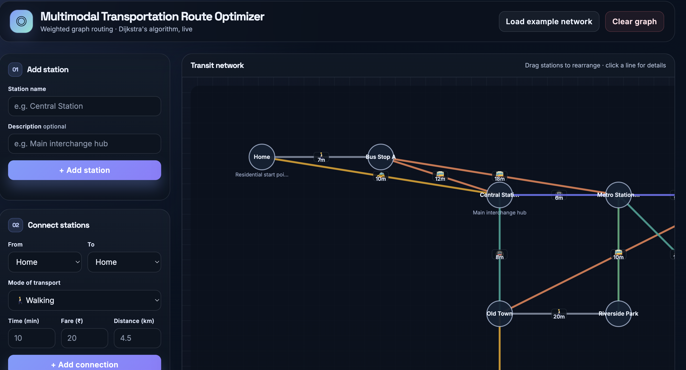
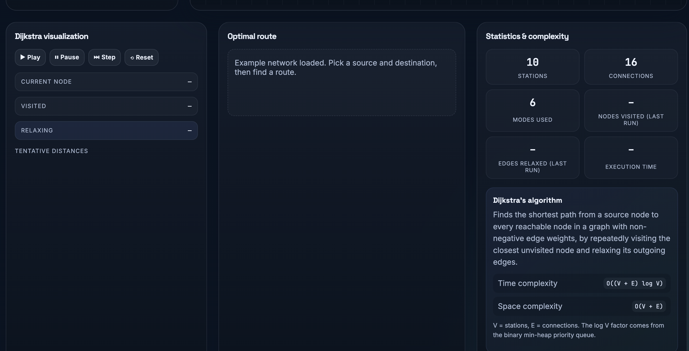

# Multimodal Transportation Route Optimizer



A lightweight, client-side interactive web app for building transit networks and finding optimal routes across multiple transport modes using Dijkstra's algorithm.

## Features

- Add stations and connections with mode-specific attributes (time, fare, distance).
- Visualize a transit network on a canvas and drag stations to rearrange.
- Find optimal routes by time, cost, or distance.
- Animate Dijkstra's algorithm step-by-step for teaching and debugging.



## Tech / Files

- Frontend: vanilla HTML, CSS, and JavaScript.
- Files in this repository:
  - `index.html` — UI and canvas.
  - `style.css` — styles and theme.
  - `script.js` — application logic (graph model, UI handlers, Dijkstra implementation).

## Quick start

1. Place the screenshot images from the project attachments into `assets/`:
   - `assets/screenshot_top.png` (the network canvas view)
   - `assets/screenshot_bottom.png` (the controls / Dijkstra view)

2. Open the project in a browser (double-click `index.html` or run a simple static server):

```bash
# from project root
python3 -m http.server 8000
# then open http://localhost:8000 in your browser
```

3. Use the left panel to add stations, connect them, and pick a source + destination.
4. Choose an objective (Fastest / Cheapest / Shortest) and click `Find optimal route`.
5. Optionally press `Animate Dijkstra` to watch the algorithm explore the graph.

## How the routing works (Dijkstra's algorithm)

The app models the transit network as a weighted graph where nodes are stations and edges are connections. Each connection has one or more weights depending on the chosen optimization objective (time, fare, distance). For a given objective the algorithm uses the corresponding numeric weight for each edge and runs Dijkstra's algorithm to compute shortest paths.

Dijkstra's algorithm (high-level):

- Initialize tentative distance `dist[s] = 0` for the source `s`, and `dist[v] = +∞` for all other vertices `v`.
- Use a priority queue keyed by tentative distance.
- Repeatedly extract the unvisited node `u` with smallest `dist[u]`.
- For each outgoing edge `(u, v)` with weight `w`, if `dist[u] + w < dist[v]` then update `dist[v] = dist[u] + w` and set `prev[v] = u`.
- Stop once the destination has been settled (or the queue empties).

Pseudocode:

```text
function dijkstra(graph, source):
  for each vertex v:
    dist[v] = +∞
    prev[v] = null
  dist[source] = 0
  Q = priority_queue() // min-heap by dist
  Q.push(source, 0)

  while Q not empty:
    u = Q.pop_min()
    if u is destination: break
    for each neighbor v of u:
      alt = dist[u] + weight(u,v)
      if alt < dist[v]:
        dist[v] = alt
        prev[v] = u
        Q.push_or_decrease_key(v, alt)

  return (dist, prev)
```

Time complexity (with a binary heap / min-priority queue) is $O((E + V)\log V)$ where $V$ is the number of vertices and $E$ is the number of edges. The algorithm requires non-negative edge weights.

